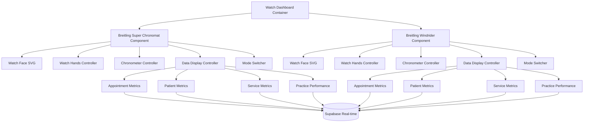
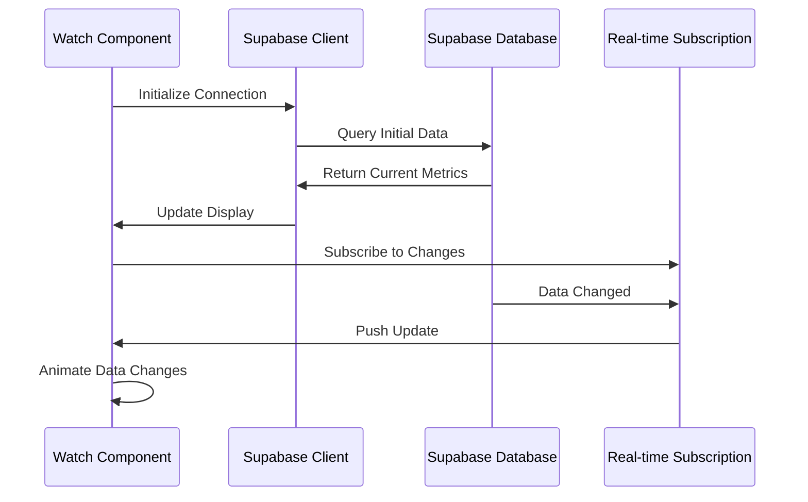

# Breitling Watch Dashboard Components - Architecture Plan

## Project Overview

Create pixel-perfect React components replicating two Breitling watch faces with:
- **Exact visual detail** with premium finishing touches
- **Functional watch mechanics** (moving hands, chronometer, date)
- **Switchable data modes** for different dental practice metrics
- **Real-time Supabase integration** with live data updates
- **Interactive controls** for switching between metric modes

## Component Architecture



## Technical Implementation Plan

### 1. Visual Replication (Ultra-High Detail)

#### Watch Face Elements
- **Bezels**: Accurate tachymeter/slide rule markings with correct typography
- **Dial Colors**: Exact color matching (Chronomat green, Windrider blue/silver)
- **Subdials**: Precise positioning and scaling of chronometer subdials
- **Hands**: Accurate shape, weight, and shadow effects
- **Markers**: Hour markers with correct Breitling typography and luminescent effects
- **Logo & Text**: Exact Breitling branding placement and font matching
- **Materials**: CSS gradients and shadows for steel/gold metallic finishes
- **Glass Effects**: Realistic sapphire crystal reflections and anti-glare coatings

#### Visual Polish Details
- **Micro-animations**: Smooth hand movements with realistic physics
- **Lighting Effects**: Dynamic shadows based on "light source"
- **Texture Mapping**: Brushed steel, polished surfaces, matte finishes
- **Color Accuracy**: Professional color calibration for exact match
- **Typography**: Custom font loading for Breitling-specific typefaces
- **Reflections**: Realistic crystal and case reflections

### 2. Functional Watch Mechanics

#### Core Time Functions
- **Real-time Clock**: Accurate hour/minute/second hands movement
- **Chronometer Functions**: Start/stop/reset with precise timing
- **Date Display**: Current date with quick-set functionality

#### Subdial Functions
- Running seconds
- 30-minute chronometer
- 12-hour chronometer
- Date display window

#### Interactive Controls
- **Crown Interaction**: Click and drag to set time/date
- **Pusher Buttons**: Clickable chronometer controls with tactile feedback
- **Mode Switching**: Smooth transitions between data modes
- **Hover Effects**: Subtle highlighting on interactive elements
- **Touch Gestures**: Swipe between modes on mobile

### 3. Data Integration Modes

#### Mode 1: Appointment Metrics
- **Main dial**: Today's appointment count (hour markers)
- **Subdial 1**: Upcoming appointments this week
- **Subdial 2**: Appointment completion rate
- **Subdial 3**: Average appointment duration
- **Digital display**: Next appointment time

#### Mode 2: Patient Metrics
- **Main dial**: Total active patients (scaled)
- **Subdial 1**: New patients this month
- **Subdial 2**: Patient satisfaction average
- **Subdial 3**: Returning patient percentage
- **Digital display**: Patient of the day

#### Mode 3: Service Metrics
- **Main dial**: Most popular service usage
- **Subdial 1**: Yomi technology procedures
- **Subdial 2**: Revenue per service type
- **Subdial 3**: Service booking trends
- **Digital display**: Top service today

#### Mode 4: Practice Performance
- **Main dial**: Daily revenue progress
- **Subdial 1**: Weekly revenue target
- **Subdial 2**: Staff productivity score
- **Subdial 3**: Testimonial ratings
- **Digital display**: Performance status

### 4. Real-time Data Pipeline



#### Data Sources (from pedrobackend)
- **Appointments**: `appointments` table with status, dates, services
- **Patients**: `patients` table with demographics and history
- **Services**: `services` table with categories, pricing, Yomi technology flags
- **Staff**: `staff` table for productivity metrics
- **Testimonials**: `testimonials` table for satisfaction ratings
- **Yomi Features**: `yomi_features` table for technology usage

#### Metrics Calculation
- Real-time aggregation of appointment data
- Patient trend analysis with moving averages
- Service popularity rankings
- Revenue calculations with time-based filtering
- Performance scoring algorithms

#### Update Strategies
- **Live Updates**: Immediate updates for critical metrics
- **Batched Updates**: Group non-critical updates for efficiency
- **Cached Data**: Local caching with smart invalidation
- **Fallback Handling**: Graceful degradation for connection issues

### 5. Component Structure

```
src/
├── components/
│   ├── watches/
│   │   ├── BreitlingChronomat/
│   │   │   ├── index.tsx
│   │   │   ├── WatchFace.tsx
│   │   │   ├── WatchHands.tsx
│   │   │   ├── Chronometer.tsx
│   │   │   ├── DataDisplay.tsx
│   │   │   └── styles.module.css
│   │   ├── BreitlingWindrider/
│   │   │   ├── index.tsx
│   │   │   ├── WatchFace.tsx
│   │   │   ├── WatchHands.tsx
│   │   │   ├── Chronometer.tsx
│   │   │   ├── DataDisplay.tsx
│   │   │   └── styles.module.css
│   │   └── shared/
│   │       ├── ModeSelector.tsx
│   │       ├── MetricsProvider.tsx
│   │       └── watchUtils.ts
├── hooks/
│   ├── useSupabaseData.ts
│   ├── useWatchTime.ts
│   └── useMetrics.ts
├── services/
│   ├── supabaseClient.ts
│   └── metricsCalculator.ts
├── types/
│   ├── watch.types.ts
│   └── metrics.types.ts
└── assets/
    ├── watch-textures/
    └── fonts/
```

### 6. Performance Optimizations

#### Rendering Optimization
- **SVG Optimization**: Minimize DOM nodes for smooth animations
- **Canvas Rendering**: Use canvas for complex animations if needed
- **Memoization**: React.memo for expensive calculations
- **Lazy Loading**: Progressive loading of watch textures

#### Data Optimization
- **Real-time Throttling**: Efficient Supabase subscription management
- **Connection Pooling**: Optimize database connections
- **Query Optimization**: Efficient SQL queries for metrics calculation

### 7. Implementation Timeline

#### Phase 1: Foundation (Week 1)
- Set up project structure and dependencies
- Create basic watch face SVG layouts
- Implement core time display functionality
- Configure Supabase connection

#### Phase 2: Visual Replication (Week 2)
- Detailed styling and visual accuracy
- Implement watch hands and animations
- Add chronometer functionality
- Create realistic materials and textures

#### Phase 3: Data Integration (Week 3)
- Supabase connection and real-time subscriptions
- Metrics calculation and display logic
- Mode switching functionality
- Data visualization on watch faces

#### Phase 4: Polish & Optimization (Week 4)
- Fine-tune animations and interactions
- Performance optimization
- Cross-browser testing and mobile responsiveness
- Final visual polish and micro-interactions

### 8. Technical Requirements

#### Dependencies
- React 18+ with TypeScript
- Supabase JavaScript client (`@supabase/supabase-js`)
- CSS Modules or Styled Components
- Framer Motion for animations
- Date-fns for time calculations
- React Query for data management (optional)

#### Browser Support
- Modern browsers with CSS Grid/Flexbox
- Hardware acceleration for smooth animations
- WebGL support for advanced effects (optional)
- Mobile responsive design

#### Development Tools
- TypeScript for type safety
- ESLint and Prettier for code quality
- Storybook for component development (optional)
- Jest and React Testing Library for testing

### 9. Data Type Definitions

#### Watch Types
```typescript
interface WatchMetrics {
  appointments: AppointmentMetrics;
  patients: PatientMetrics;
  services: ServiceMetrics;
  performance: PerformanceMetrics;
}

interface AppointmentMetrics {
  todayCount: number;
  weeklyUpcoming: number;
  completionRate: number;
  averageDuration: number;
  nextAppointment: Date | null;
}

interface PatientMetrics {
  totalActive: number;
  newThisMonth: number;
  satisfactionAverage: number;
  returningPercentage: number;
  patientOfTheDay: string;
}
```

#### Watch Component Props
```typescript
interface WatchComponentProps {
  model: 'chronomat' | 'windrider';
  size: 'small' | 'medium' | 'large';
  dataMode: 'appointments' | 'patients' | 'services' | 'performance';
  realTimeUpdates: boolean;
  interactiveMode: boolean;
}
```

### 10. Success Criteria

#### Visual Accuracy
- [ ] Exact color matching to original Breitling watches
- [ ] Precise proportions and scaling
- [ ] Realistic materials and textures
- [ ] Smooth, physics-based animations
- [ ] Professional-grade visual polish

#### Functionality
- [ ] Accurate timekeeping and chronometer functions
- [ ] Seamless mode switching between metrics
- [ ] Real-time data updates from Supabase
- [ ] Responsive design across devices
- [ ] Intuitive user interactions

#### Performance
- [ ] Smooth 60fps animations
- [ ] Fast data loading and updates
- [ ] Efficient memory usage
- [ ] Cross-browser compatibility
- [ ] Mobile optimization

This architecture plan provides a comprehensive roadmap for creating ultra-detailed, functional Breitling watch replica components that seamlessly integrate with Dr. Greg Pedro's dental practice data from Supabase, delivering both visual excellence and practical business intelligence through an innovative luxury watch interface.